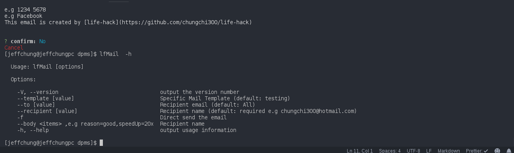
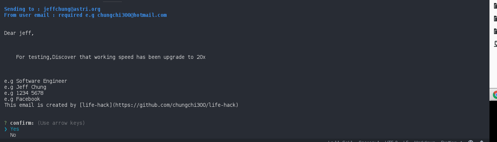

# Goal

**An hackable script for my daily task**

```
Mailing
lfMail  --recipient Jeff --to chungchi300@hotmail.com --body reason=testing,speedUp=20x
lfSlack --conversationId CCBGKLVN2 --text message
```




# Advantage

- write by nodejs,using `async await for async task` and **more readable**
- Sharable by version control
- Easy to hack,it is written by `commander` and `inquirer`,formatted by `chalk`
- Support mail to Microsoft Mail Server
- Support **markdown mailing** syntax

# Requirement

Node that support async await(>7.6)

# Installation

```
git clone
npm install life-hack -g
// config src/lib/mail/config.js,especially your email username and password , and the src/lib/slack/config.js
```

# Hacking

## Development,Updating command implementation

Just upgrade the script,it will `automatically` upgrade system command implementation

## Publish to global,updating commands interface

1. Change your `package.json` - `bin` field
2. `npm install life-hack` again,which create symlink
